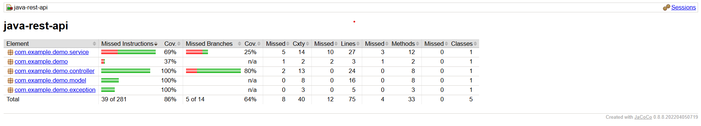

# Java REST API

## Descrição do Projeto

Este projeto consiste em uma API REST desenvolvida com Spring Boot para gerenciamento de itens.  
A aplicação suporta respostas nos formatos JSON e XML.

O objetivo desta atividade foi implementar e expandir testes unitários automatizados, garantindo a validação das regras de negócio, cenários de sucesso e tratamento de erros.

---

## Regras de Negócio

As principais regras implementadas são:

- O campo **name é obrigatório**
- O campo **description é obrigatório**
- Não é permitido enviar valores nulos ou vazios
- JSON inválido retorna **400 Bad Request**
- Item inexistente retorna **404 Not Found**
- Busca por nome não aceita valores vazios
- Atualização parcial não permite descrição vazia

---

## Como Executar a Aplicação

No terminal, execute:

cd java-rest-api
mvn spring-boot:run

A API estará disponível em:
http://localhost:8080/api/items

---

## Como Executar os Testes

Para executar os testes unitários:

mvn test

---

## Cobertura de Testes

Para gerar o relatório de cobertura com JaCoCo:

mvn clean verify

O relatório será gerado em:
target/site/jacoco/index.html

---

## Resultado

O projeto apresenta alta cobertura de testes, validando corretamente regras de negócio, cenários de erro e funcionamento da API.
